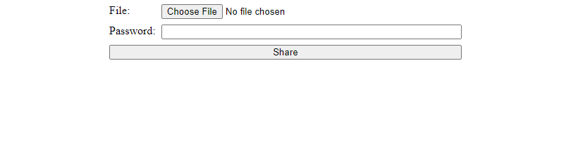

# File Sharing With Node JS

This app allows a user to upload a file and recieve a link to share the file with someone else. Shared files can be protected by passwords.

## Build Steps ⚙

This project was built with NodeJs -v 14.xx. Packages used includes:

    1. bcrypt ^5.0.1
    2. ejs ^3.1.8
    3. express ^6.4.4
    4. mongoose ^6.4.4
	5. multer ^1.4.5-lts.1
	6. dotenv ^16.0.1

Running Locally 🖥️
1. Clone repo using the following command:
    ```shell script
    git clone https://github.com/Itsyaboikris/file-sharing-nodejs.git 
    ```
2. cd in project directory
4. Install dependencies
    ```shell script
    npm install
    ```
5. Run project 🎉
    ```shell script
    npm run devStart
    ```

## Project structure 📁

The code for this project can be found in the following files:

- `views\index.ejs views\password.ejs` - HTML upload forms
- `server.js`- Logic 
- `models\File.js` - Mongoose File Model